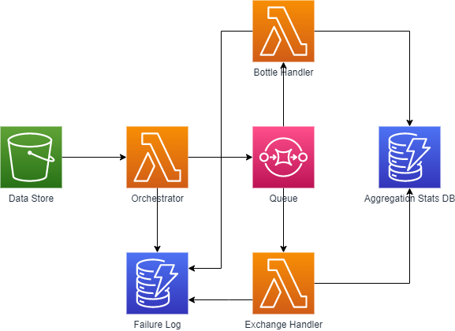

# High level overview
This CDK stack defines Lambda functions to iterate through oceanographic data files in parallel.
The functions compute some aggregate representation for each file, then save the result to a database.
<br><br>
A GitHub Actions workflow to build and deploy any changes made on each push is also included.
<br><br>

<br>
We can follow this flowchart to better understand the flow of data through the stack. Implementation details are omitted here, and included in sections below. 
<br><br>
1. Our **Orchestrator Function** first iterates through files stored in a **Data Store**.
2. For each file, it identifies the type of file, and hands off the reference to a **Queue** for the appropriate **Handler Function** (Or saves to the **Failure Log** if it cannot identify the file type).
3. The **Handler Functions** process through the file references in the **Queue**, and attempt to compute some kind of aggregate. If successful, they save the result to an **Aggregation Stats DB**. Otherwise, they log to the **Failure Log**.

# Stack Specification
Most of the infrastructure is specified in this Python file: [`data_review_stack.py`](data_review/data_review_stack.py). This is the file that you should change if you want to hook up the stack to an external S3 bucket, use a different DBMS, etc. 

# Data Store
In this stack, the Data Store is implemented as an S3 bucket. It uses [s3deploy](https://docs.aws.amazon.com/cdk/api/latest/docs/aws-s3-deployment-readme.html) to load any data in the `test_data/` directory into the bucket (under the hood, this creates another lambda function that is only called when the stack is created or updated).
<br><br>
Apart from the deployment lambda function, all lambda functions have **read-only** access to the bucket.

# Lambda Functions
Lambda functions are specified in [`data_review_stack.py`](data_review/data_review_stack.py) - here you can change the memory allocation, max runtime, execution environment, etc. The actual function logic can be found in the `lambda/` directory.

Each subfolder in the `lambda/` directory corresponds to a different **Handler Function**, and contains an `index.py` file with the function logic, and a `requirements.txt` file with any dependencies. The `requirements.txt` is parsed and handled when the stack is deployed, and dependencies are uploaded with the function logic during the build step (more on this below). 

# Queue
Currently, there is no queue implemented - the Orchestrator Function directly calls the Handler Functions. Using a queue has the benefit of being able to limit the concurrency of the Handler Functions (you could just change the `reserved_concurrent_executions` attribute in the specification for the Lambda Functions, but this would mean any calls that would go over the concurrency limit will fail, instead of waiting to be called later).

A queue is not necessary for the basic functionallity described. However, if one wanted to add a queue to the implementation, they could use [SQS](https://docs.aws.amazon.com/cdk/api/latest/python/aws_cdk.aws_sqs/README.html).

# Databases
DynamoDB was used, primarily for simplicity - it can be swapped out for other DBMSs if needed.

The DynamoDB instances are `PAY_PER_REQUEST`, specified in `data_review_stack.py`, as opposed to explicitly provisioned read/write instances which is the default. This simplifies implementation - you don't have to worry about the concurrency of writes in Lambda functions (which would be very annoying given their stateless nature), and does not cost a signficant amount - [$1.25 per 1 million writes](https://aws.amazon.com/dynamodb/pricing/) as of writing.

It is unfortunately nontrival to download a csv snapshot of the databases (you can't just do a `SELECT * FROM table`). [DynamoDBtoCSV](https://github.com/edasque/DynamoDBtoCSV) is an external js tool that can do this, and it includes documentation on its usage.

# Building / Deploying

## Github Actions
Building / deploying the stack is handled through Github Actions. [`main.yml`](./.github/workflows/main.yml) is the main workflow file. The workflow can be manually run to build and deploy the stack, or it can be configured triggered by a push to the repository (this is currently disabled, but can be enabled by uncommenting some lines in the `main.yml` file).

AWS Keys are configured using Github Secrets. For compatibility with the Actions workflow, name your key ID and secret key `AWS_ACCESS_KEY_ID` and `AWS_SECRET_ACCESS_KEY`, respectively. Also, save the desired region to deploy to as `AWS_REGION` (e.g. `us-east-1`).

## Manual Deployment
Working with AWS credentials from multiple AWS accounts can get annoying and messy, I've found this VS Code extension helpful for dealing with this: [AWS CLI Configure](https://marketplace.visualstudio.com/items?itemName=mark-tucker.aws-cli-configure).


### Prerequisites:
- [AWS CLI](https://aws.amazon.com/cli/)
- AWS credentials locally configured (`aws configure`)
- [CDK](https://docs.aws.amazon.com/cdk/v2/guide/getting_started.html#getting_started_install) (`npm install -g aws-cdk`)
- [Docker](https://www.docker.com/products/docker-desktop)
- [Python](https://www.python.org/downloads/) (Only tested so far on 3.8)

### Steps:


- Clone the repository
- Create a virtual environment, and install the necessary CDK packages
```
python -m venv .venv
source .venv/Scripts/activate
pip install -r requirements.txt
```
- Build and deploy the stack
```
cdk synth; cdk deploy
```